<!-- Main -->

<!-- Two -->
<section id="two" class="spotlights">
	<section>
		
		

			

				<header class="major">
					<h3>Minesweeper - Constraint Satisfaction Problems</h3>
				</header>
				
Second project for CS520: Introduction to Artificial Intelligence, where the goal was to create an AI bot able to solve Minesweeper at different levels of difficulty. 3 different solvers are created:
				<ul>
				<li><b>Basic Solver:</b>The basic solver is the most risk-free solver which will not think on its own but just play the safest moves possible. It will stop the game if there are no further safe moves possible. It is a baseline model which we developed to evaluate the accuracy and effectiveness of the other complex models.</li>
				<li><b>CSP Solver:</b>This is the main bot which plays the game just like humans. CSP refers to Constraint Satisfaction Problem since this is the main algorithm used by the agent. It plays the game just like a normal human - by creating different constraints for each square opened and each mine flagged. When it opens a cell or flags it, the knowledge base is updated and the constraints/equations are resolved.</li>
				<li><b>Bonus CSP Solver:</b>This is just en extension of the the CSP solver. Unlike a typical mineweeper game where the agent will know what lies behind a cell once it is opened, this solver will only get the information with some probability. Hence, if it opens a cell, there is an 80% chance of the agent receiving the correct information.</li>
				</ul>

				<figure>
					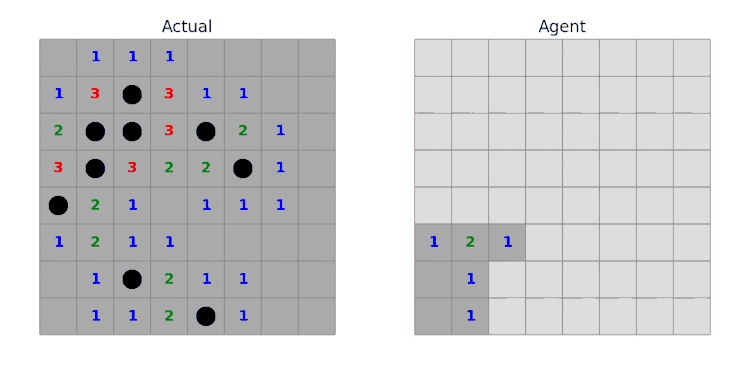	
					<figcaption>Left: True Environment, Right: Solver</figcaption>
				</figure>
				<ul class="actions">
					<li><a href="https://github.com/vedantc6/CS520-AI/tree/master/MineSweeper" class="button">Learn more</a></li>
				</ul>
			

		

	</section>
	<!-- <section>
		
		

			

				<header class="major">
					<h3>Mazerunner - AI Search Algorithms</h3>
				</header>
				
The goal of this project is to compare and analyse different search algorithms commonly used in AI. A grid is generated and presented as an environment to the agent.
				<ul>
				<li>Red squares repesent the source and destination. The agent starts from top-left corner and has to reach bottom-right corner.</li>
				<li>Black cells represent obstacles</li>
				<li>White cells represent explorable space</li></ul> 
				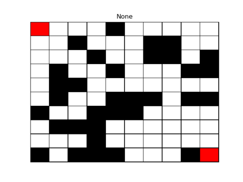 
				Three different algorithms are used:
				<ul>
				<li>Breadth-First Search</li>
				<li>Depth-First Search</li>
				<li>A* Algorithm with Euclidean and Manhattan distance heuristics</li>
				</ul>
				The project is divided into 4 stages:
				<ul>
				<li><b>Time analysis and comparison -</b> A comparison of the different algorithms in terms of time taken to find optimal paths, size of different mazes and which performs better</li>
				<li><b>Generating hard mazes -</b> Finding harder mazes based on length of shortest path, nodes expanded by an algorithm, max. time taken to find the path</li>
				<li><b>Thinning A* -</b> A variation of the A* algorithm to reduce number of redundant searches</li>
				<li><b>Fire in the Maze -</b> A variation of the search problem, which tests the intelligence of the agent when raced against time. With every new timestep, the fire starts spreading to adjacent nodes, and now the agent has to reach the destination while avoiding fire. This is accomplished by using a heuristic based DFS approach, where closeness to fire is penalized while closeness to target is rewarded</li>
				</ul>
				

					<figure>
						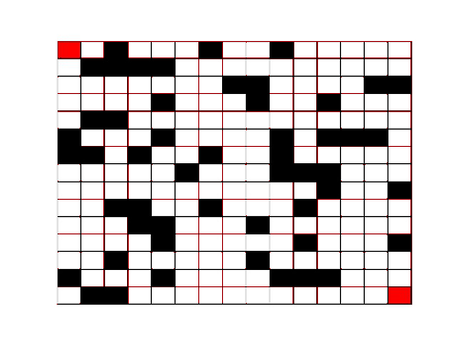
						<figcaption>DFS</figcaption>
					</figure>
					<figure>
						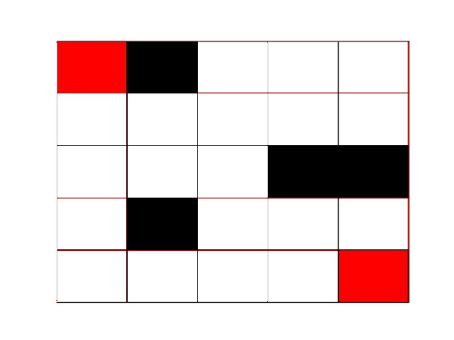
						<figcaption>BFS</figcaption>
					</figure>
					<figure>
						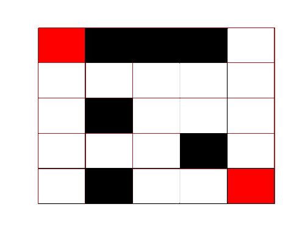
						<figcaption>A*</figcaption>
					</figure>
					<figure>
						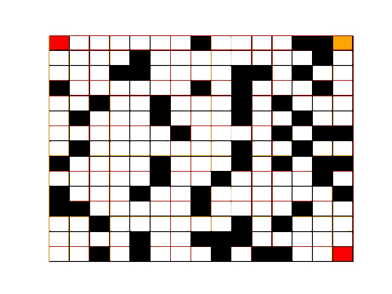	
						<figcaption>DFS for Fire Maze</figcaption>
					</figure>
				

				<ul class="actions">
					<li><a href="https://github.com/vedantc6/CS520-AI/tree/master/MazeRunner" class="button">Learn more</a></li>
				</ul>
			

		

	</section> -->
	<section>
		<a href="generic.html" class="image">
			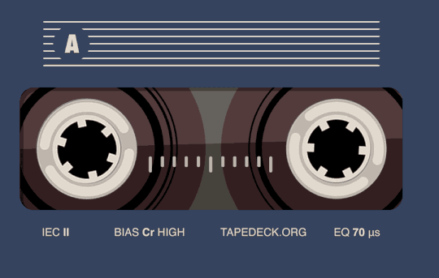
		</a>
		

			

				<header class="major">
					<h3>Music Genre Belief Recognition</h3>
				</header>
				
This was the major project for the course CS543: Massive Data Storage and Retrieval. The aim of the project was to be able to predict genre of a song with time sequencing. It was conceptualized and modelled with the help of spectrograms, convolutional neural networks and recurrent neural networks (later replaced by time-distributed layers to improve upon accuracy). Finally, the model was deployed and visualized on web by using TensorflowJS front-end development. <b>Tech used: Python, TensorflowJS, Keras, JavaScript, HTML, CSS</b> 
				<iframe width="560" height="315" src="https://www.youtube.com/embed/2p-13hnVhA0" frameborder="0" allow="accelerometer; autoplay; encrypted-media; gyroscope; picture-in-picture" allowfullscreen></iframe>

				<ul class="actions">
					<li><a href="https://github.com/vedantc6/CS543-MusicGenreRecognition" class="button">Learn more</a></li>
				</ul>
			

		

	</section>
	<section>
		<a href="generic.html" class="image">
			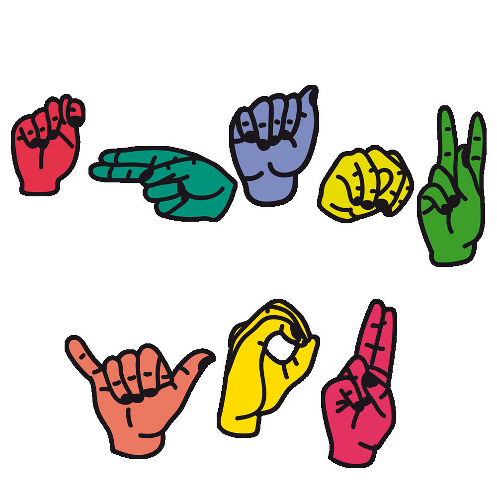
		</a>
		

			

				<header class="major">
					<h3>Live Transcription of Sign Language using Convolutional Neural Networks</h3>
				</header>
				
This project was my Bachelor Thesis project and my introduction to the world of convolutional neural networks. The aim of the project was to deploy a webcam based user interface which could predict the sign language in real time. The core of the model is a CNN architecture, trained on a dataset of ~0.17 million images, achieving an accuracy of 97%. The github repo is kind of unstructured, which needs to be updated soon. <b>Tech used: Python, TensorflowJS, Keras, OpenCV</b>

				<ul class="actions">
					<li><a href="https://github.com/vedantc6/LiveSignLanguageCNNs" class="button">Learn more</a></li>
				</ul>
			

		

	</section>
	<section>
		<a href="generic.html" class="image">
			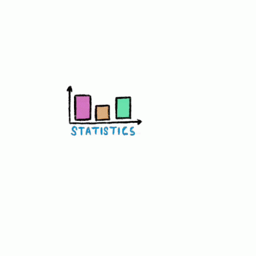
		</a>
		

			

				<header class="major">
					<h3>Scratching Statistics </h3>
				</header>
				
A plethora of projects/assignments I completed as part of my CS581: Probability and Statistics, all from scratch. The github repo attached consists an EDA on Hurricane data, which used Monte Carlo Simulation to establish if the data followed Poisson distribution or not, Method of Moments and Maximum Likelihood estimations for discrete and continuous distributions, Goodness of Fit through Kolmogorov Smirnov test, Sampling methods like Bootstrap and Jackknife followed by the major project which involved finding out over and under-expressed genes in NCI60 data-set by using student t-test and false discovery rates.<b>Tech used: R Programming</b>

				<ul class="actions">
					<li><a href="https://github.com/vedantc6/CS581ProbStat" class="button">Learn more</a></li>
				</ul>
			

		

	</section>
	<section>
		<a href="generic.html" class="image">
			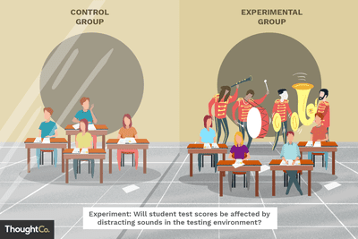
		</a>
		

			

				<header class="major">
					<h3>Test and Control Methodology - Retail Stores</h3>
				</header>
				
During my time as a data analyst for <b><a href="https://www.thesmartcube.com/">The Smart Cube</a></b>, I worked on providing a test and control methodology for a major retail client. The main purpose for the project was to give a clear picture of how the client stores would get impacted in terms of sales if the client decided to do some changes in a store or a bunch of stores (position/space/range/new/old sections). The technology I deployed used a lot of statistical tests like slope-test, co-integration test and correlation tests to group stores which behaved similar in terms of sales, demographics etc. <b>Tech used: SAS Programming, Microstrategy, SQL, Excel</b>

			

		

	</section><section>
		
		

			

				<header class="major">
					<h3>Hierarchical Mixed Effects Modeling - Retail Stores</h3>
				</header>
				
Another project during my time as a data analyst for <b><a href="https://www.thesmartcube.com/">The Smart Cube</a></b> was on creating a Hierarchical Mixed Effects model for a major retail client, which allowed the client to gauge on the predicted impact on sales of products in its stores based on its demographics, weather, holidays, store changes such as change in position/range/space of items or renewal and discontinuation of items among other variables. The reason for choosing this type of model was due to the multi-level nature of data. <b>Tech used: R Programming, Excel</b>

			

		

	</section>
	<section>
		<a href="generic.html" class="image">
			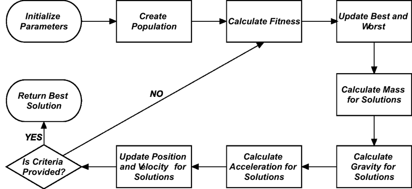
		</a>
		

			

				<header class="major">
					<h3>Gravitational Search Algorithm in Recommendation Systems</h3>
				</header>
				
Project of many firsts. First Published paper - First International Conference - First Research experience. The motivation that stemmed the conceptualization of this paper was along the lines of fusing computational intelligence techniques with Collaborative filtering methods. It explored a relatively new bio-inspired meta-heuristic algorithm named Gravitational Search Algorithm(GSA) for the purpose of recommending jokes to users. Later, I presented the paper in the 8th International Conference on Swarm Intelligence, Fukuoka, Japan. <b>Tech used: Python, Latex</b>

				<ul class="actions">
					<li><a href="https://link.springer.com/chapter/10.1007/978-3-319-61833-3_63" class="button">Learn more</a></li>
				</ul>
			

		

	</section>
	<section>
		<a href="generic.html" class="image">
			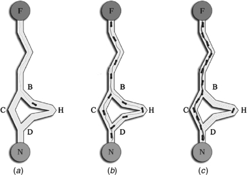
		</a>
		

			

				<header class="major">
					<h3>Tackling TSP with Ant Colony Optimization and Visualization</h3>
				</header>
				
Final project for CS512:Data Structures and Algorithms. The traveling salesman problem was tackled with the help of a nature inspired technique called ant colony Optimization. The project models the probabilistic behavior of pheromone chemical interactions between ants while foraging for food. A simple user interface was also created to allow the user to play with the number of ants and steps the program should be run for. The final output was a visualization of the order of cities to be traveled so as to cover the least distance possible. <b>Tech used: Python</b>

				<ul class="actions">
					<li><a href="https://github.com/vedantc6/TSPACO" class="button">Learn more</a></li>
				</ul>
			

		

	</section>
	<section>
		
		

			

				<header class="major">
					<h3>Recommendation Systems</h3>
				</header>
				
Some of the basic and intermediate level work I did on recommendation systems before starting research work on <a href="https://link.springer.com/chapter/10.1007/978-3-319-61833-3_63">my paper</a> in my undergraduate days. Implementing song recommendation system based on popularity and items, movie recommendation system using Collaborative filtering with Particle Swarm Optimization (which later was a comparison algorithm for the paper). <b>Tech used: Python</b>

				<ul class="actions">
					<li><a href="https://github.com/vedantc6/MusicRecommendation" class="button">Learn more</a></li>
				</ul>
			

		

	</section>
	<section>
		<a href="generic.html" class="image">
			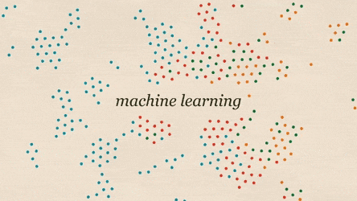
		</a>
		

			

				<header class="major">
					<h3>Machine Learning Algorithms from scratch</h3>
				</header>
				
I worked on this project in order to understand how various machine learning algorithms work and to understand the math behind them. This project also serves as a refresher for someone who would like to go through the basic implementations of algorithms such as Linear/Logistic Regression, KNNs, ANNs, etc. <b>Tech used: Python</b>

				<ul class="actions">
					<li><a href="https://github.com/vedantc6/MLScratch" class="button">Learn more</a></li>
				</ul>
			

		

	</section>
</section>

